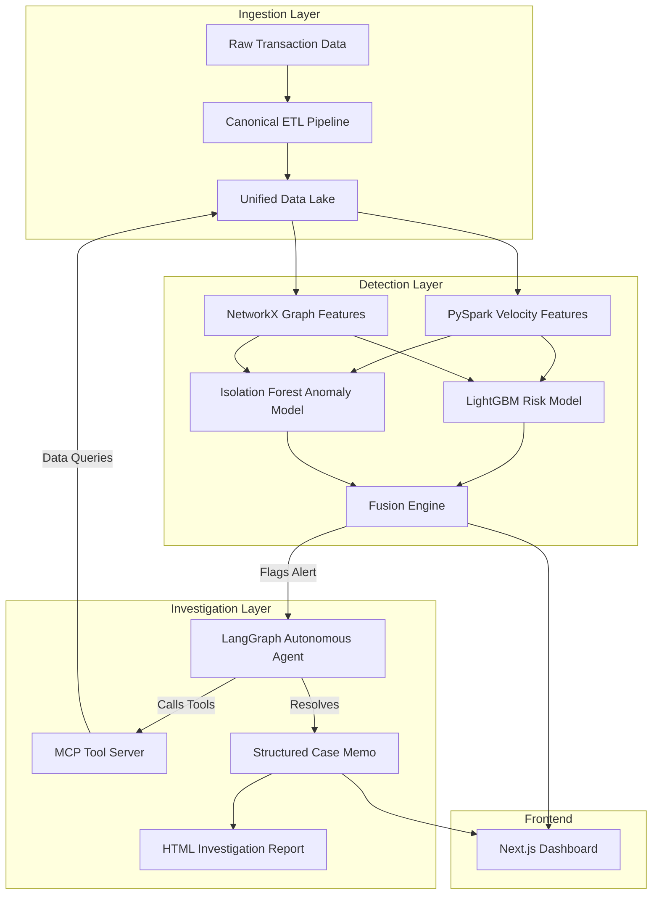
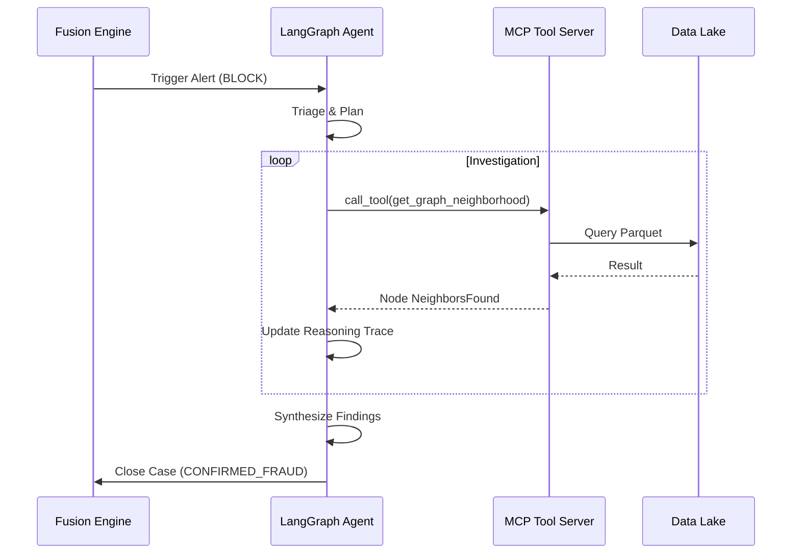
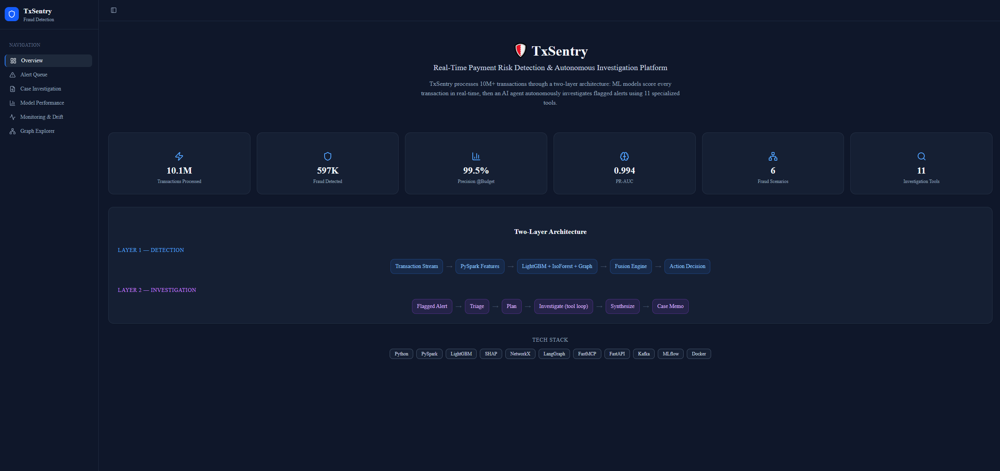
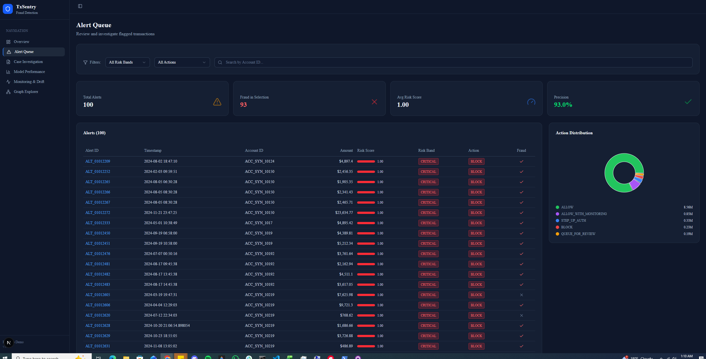
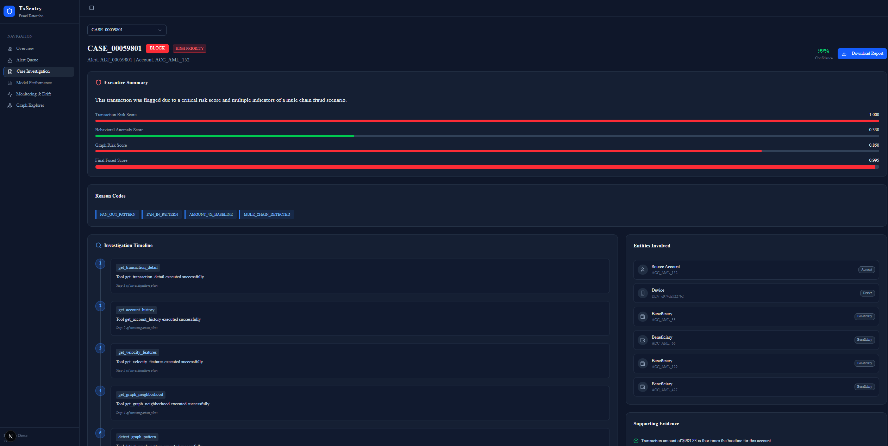
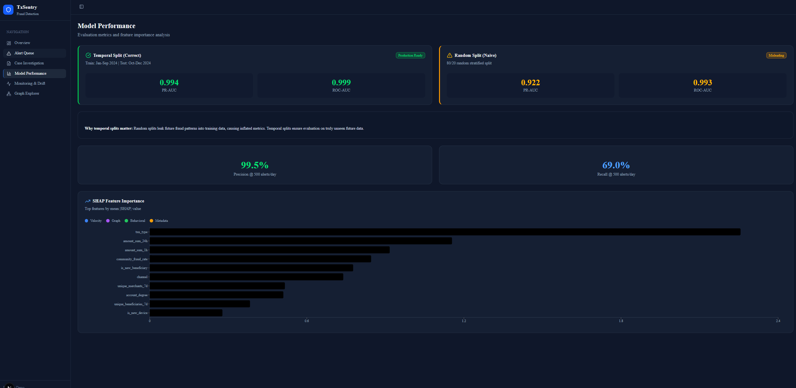
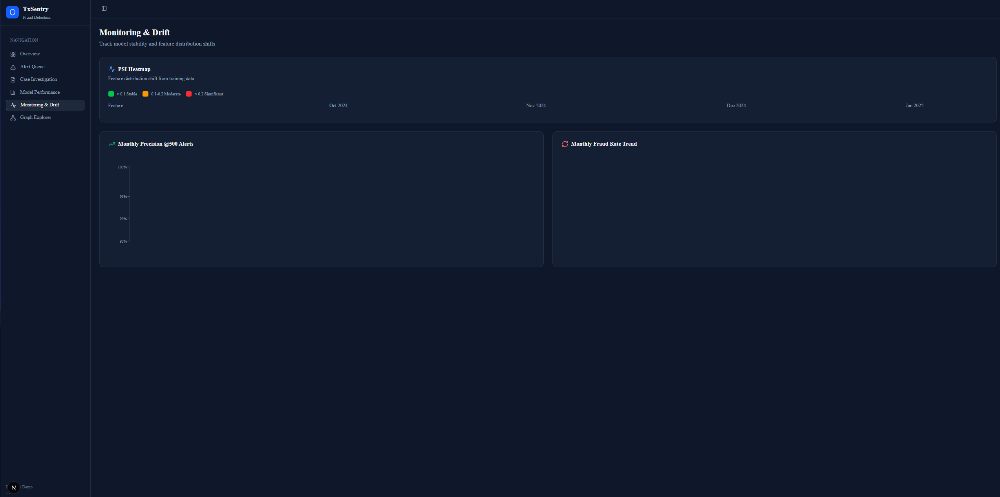
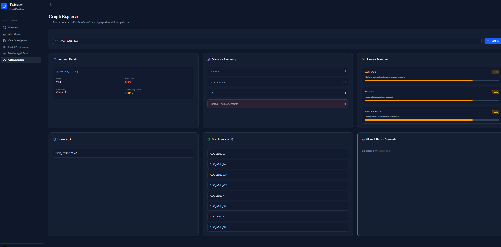

# TxSentry

TxSentry is a real-time payment fraud detection and autonomous investigation platform. It implements a two-layer architecture: a **Detection Layer** (high-throughput ML models scoring transactions) and an **Investigation Layer** (a stateful LangGraph agent that autonomously investigates flagged alerts via MCP tools).

The system is designed for high-scale financial environments, processing over 10M transactions with a blended architecture of supervised learning, unsupervised anomaly detection, and graph-based topology analysis.

## System Architecture

The platform follows a modular pipeline from raw data ingestion to autonomous case resolution.



## Key Components

### Detection Layer (AI & ML)
TxSentry utilizes a multi-model fusion approach to identify fraudulent behavior:
- **LightGBM (Supervised)**: Optimized for precision@budget, trained on 10.1M transactions with temporal splitting to handle fraud drift.
- **Isolation Forest (Unsupervised)**: Detects behavioral anomalies (e.g., burst velocity, new device clusters) without requiring prior labels.
- **Graph Neural Signals**: Extract topology patterns like fan-out/fan-in structures, shared device rings, and mule chains using NetworkX and Louvain community detection.
- **SHAP Explainability**: Every flagged transaction includes top-5 feature attributions, providing transparency into "why" a transaction was blocked.

### Investigation Layer (Autonomous Agents)
Instead of relying on human analysts for initial triage, TxSentry deploys a stateful agentic workflow built with **LangGraph**:
- **Triage Node**: Assesses alert severity and determines investigation depth.
- **Planner Node**: Generates a dynamic tool-call plan based on the fraud scenario.
- **Investigator Node**: Iteratively calls MCP tools to gather evidence (graph neighborhoods, account baselines, watchlist status).
- **Synthesizer Node**: Aggregates findings into a legal-ready Case Memo.

### Model Context Protocol (MCP) Server
The **MCP Tool Server** exposes 11 specialized tools that bridge the gap between the LLM and the data lake:
- **Transaction Tools**: `get_transaction_history`, `get_velocity_features`.
- **Relationship Tools**: `get_graph_neighborhood`, `detect_graph_pattern`.
- **Risk Tools**: `check_watchlist`, `run_anomaly_score`, `get_similar_cases`.

## Case Investigation Workflow



## Visual Gallery

### Dashboard Overview


### Alert Queue


### Case Investigation


### Model Performance


### Drift Monitoring


### Graph Explorer


## Technical Results

| Metric | Result |
|---|---|
| Precision @ 500 alerts/day | 99.54% |
| PR-AUC (Temporal Split) | 0.9939 |
| Data Scale | 10.1M Txns |
| Investigation Latency | ~50s / alert |
| Tool Accuracy | 100% (Smoke Tested) |

## Setup

### Backend (Python)
1. Initialize environment:
   ```bash
   python3.11 -m venv .venv
   source .venv/bin/activate
   pip install -r requirements.txt
   ```
2. Configure credentials:
   ```bash
   cp .env.example .env
   # Add OPENAI_API_KEY
   ```
3. Run Ingestion & Training:
   ```bash
   python -m txsentry.pipelines.ingestion.run_ingestion
   python -m txsentry.pipelines.model_training
   ```

### Frontend (Next.js)
```bash
cd txsentry/ui/txSentry-ui
npm install
npm run dev
```
